# GitHub Actions 워크플로우 가이드 📚

> **Marp 프레젠테이션을 GitHub Pages로 자동 배포하기**

이 문서는 `.github/workflows/marp-to-pages.yml` 파일이 무엇을 하는지, 어떻게 작동하는지 대학생도 쉽게 이해할 수 있도록 설명합니다.

## 🎯 이 워크플로우가 하는 일

간단히 말하면: **Markdown 프레젠테이션 파일을 HTML로 변환해서 웹사이트로 자동 배포합니다.**

1. `docs/presentation.md` 파일을 수정하고 GitHub에 푸시하면
2. 자동으로 HTML 슬라이드로 변환되고
3. GitHub Pages에 배포되어 웹에서 볼 수 있게 됩니다

## 📖 코드 상세 설명

### 1️⃣ 워크플로우 이름 및 트리거 설정

```yaml
name: Marp to GitHub Pages

on:
  push:
    branches:
      - main
    paths:
      - 'docs/presentation.md'
      - '.github/workflows/marp-to-pages.yml'
  workflow_dispatch:
```

**설명:**
- `name`: 워크플로우의 이름입니다. GitHub Actions 탭에서 이 이름으로 표시됩니다.
- `on`: 워크플로우가 **언제** 실행될지 정의합니다.
  - `push`: 코드를 푸시할 때 실행
    - `branches: - main`: `main` 브랜치에 푸시할 때만
    - `paths`: 특정 파일이 변경되었을 때만 실행
      - `docs/presentation.md`: 프레젠테이션 파일이 수정되었을 때
      - `.github/workflows/marp-to-pages.yml`: 워크플로우 파일 자체가 수정되었을 때
  - `workflow_dispatch`: GitHub 웹사이트에서 수동으로 실행할 수 있게 합니다

**쉽게 말하면:** "프레젠테이션 파일을 수정하거나, 이 설정 파일을 수정해서 main 브랜치에 푸시하면 자동으로 실행돼!"

---

### 2️⃣ 권한 설정

```yaml
permissions:
  contents: read
  pages: write
  id-token: write
```

**설명:**
- `contents: read`: 저장소의 코드를 읽을 수 있는 권한
- `pages: write`: GitHub Pages에 배포할 수 있는 권한
- `id-token: write`: 보안 인증 토큰을 생성할 수 있는 권한

**쉽게 말하면:** "이 워크플로우가 코드를 읽고, GitHub Pages에 배포할 수 있도록 허락해줘!"

---

### 3️⃣ 동시 실행 제어

```yaml
concurrency:
  group: "pages"
  cancel-in-progress: false
```

**설명:**
- `group: "pages"`: 같은 그룹의 워크플로우는 동시에 실행되지 않습니다
- `cancel-in-progress: false`: 이미 실행 중인 워크플로우를 취소하지 않습니다

**쉽게 말하면:** "배포가 진행 중일 때 새로운 배포 요청이 오면, 기존 배포가 끝날 때까지 기다려!"

---

### 4️⃣ Build 작업 (빌드 단계)

```yaml
jobs:
  build:
    runs-on: ubuntu-latest
```

**설명:**
- `jobs`: 워크플로우에서 실행할 작업들을 정의합니다
- `build`: 첫 번째 작업의 이름
- `runs-on: ubuntu-latest`: Ubuntu Linux 최신 버전에서 실행

**쉽게 말하면:** "Ubuntu 컴퓨터를 하나 빌려서 빌드 작업을 시작할게!"

#### 📝 Step 1: 저장소 체크아웃

```yaml
steps:
  - name: Checkout repository
    uses: actions/checkout@v4
```

**설명:**
- GitHub 저장소의 코드를 가상 컴퓨터로 복사해옵니다
- `actions/checkout@v4`: GitHub에서 제공하는 공식 액션을 사용

**쉽게 말하면:** "GitHub에 있는 내 코드를 작업 컴퓨터로 다운로드해!"

#### 📝 Step 2: Node.js 설치

```yaml
- name: Setup Node.js
  uses: actions/setup-node@v4
  with:
    node-version: '20'
```

**설명:**
- Node.js를 설치합니다 (JavaScript 실행 환경)
- `node-version: '20'`: Node.js 버전 20을 설치

**쉽게 말하면:** "Marp CLI를 실행하려면 Node.js가 필요해. 버전 20으로 설치해줘!"

#### 📝 Step 3: Marp CLI 설치

```yaml
- name: Install Marp CLI
  run: npm install -g @marp-team/marp-cli
```

**설명:**
- `npm install -g`: npm(Node Package Manager)을 사용해 전역으로 설치
- `@marp-team/marp-cli`: Markdown을 슬라이드로 변환하는 도구

**쉽게 말하면:** "Markdown을 HTML 슬라이드로 변환해주는 Marp 도구를 설치해!"

#### 📝 Step 4: 프레젠테이션 빌드

```yaml
- name: Build presentation
  run: |
    mkdir -p dist
    marp docs/presentation.md -o dist/index.html --html
```

**설명:**
- `mkdir -p dist`: `dist` 폴더를 생성합니다 (이미 있으면 무시)
- `marp docs/presentation.md`: 프레젠테이션 파일을 입력으로 사용
- `-o dist/index.html`: 출력 파일을 `dist/index.html`로 저장
- `--html`: HTML 태그를 허용합니다

**쉽게 말하면:** "presentation.md 파일을 읽어서 HTML 슬라이드로 변환하고, dist 폴더에 index.html로 저장해!"

#### 📝 Step 5: 아티팩트 업로드

```yaml
- name: Upload artifact
  uses: actions/upload-pages-artifact@v3
  with:
    path: ./dist
```

**설명:**
- 빌드된 파일들을 GitHub Pages 배포용 아티팩트로 업로드합니다
- `path: ./dist`: `dist` 폴더의 내용을 업로드

**쉽게 말하면:** "만든 HTML 파일을 GitHub Pages에 배포할 수 있도록 패키징해서 올려!"

---

### 5️⃣ Deploy 작업 (배포 단계)

```yaml
deploy:
  environment:
    name: github-pages
    url: ${{ steps.deployment.outputs.page_url }}
  runs-on: ubuntu-latest
  needs: build
```

**설명:**
- `environment`: 배포 환경 설정
  - `name: github-pages`: GitHub Pages 환경
  - `url`: 배포된 사이트의 URL (자동으로 생성됨)
- `needs: build`: `build` 작업이 성공적으로 완료된 후에만 실행

**쉽게 말하면:** "빌드가 성공하면, 이제 GitHub Pages에 배포할 차례야!"

#### 📝 Step: GitHub Pages 배포

```yaml
steps:
  - name: Deploy to GitHub Pages
    id: deployment
    uses: actions/deploy-pages@v4
```

**설명:**
- GitHub Pages에 실제로 배포합니다
- `id: deployment`: 이 단계를 `deployment`라는 이름으로 참조할 수 있게 합니다

**쉽게 말하면:** "패키징된 파일을 GitHub Pages에 올려서 웹사이트로 만들어!"

---

## 🔄 전체 흐름 요약

```mermaid
graph LR
    A[코드 푸시] --> B[워크플로우 트리거]
    B --> C[저장소 체크아웃]
    C --> D[Node.js 설치]
    D --> E[Marp CLI 설치]
    E --> F[Markdown → HTML 변환]
    F --> G[아티팩트 업로드]
    G --> H[GitHub Pages 배포]
    H --> I[웹사이트 완성! 🎉]
```



1. **트리거**: `presentation.md` 파일을 수정하고 푸시
2. **준비**: 코드 다운로드 + 필요한 도구 설치
3. **빌드**: Markdown → HTML 변환
4. **배포**: GitHub Pages에 업로드
5. **완료**: https://bsagom.github.io/Demo2/ 에서 확인 가능!

---

## 💡 자주 묻는 질문

### Q1: 워크플로우가 실행되지 않아요!
**A:** 다음을 확인해보세요:
- `main` 브랜치에 푸시했나요?
- `docs/presentation.md` 파일을 수정했나요?
- GitHub Actions가 활성화되어 있나요?

### Q2: 배포는 성공했는데 페이지가 안 보여요!
**A:** GitHub Pages 설정을 확인하세요:
- 저장소 Settings → Pages
- Source를 "GitHub Actions"로 설정했는지 확인

### Q3: 워크플로우를 수동으로 실행하고 싶어요!
**A:** GitHub 웹사이트에서:
1. Actions 탭으로 이동
2. "Marp to GitHub Pages" 워크플로우 선택
3. "Run workflow" 버튼 클릭

### Q4: 다른 파일도 배포하고 싶어요!
**A:** `paths` 섹션에 파일 경로를 추가하세요:
```yaml
paths:
  - 'docs/presentation.md'
  - 'docs/another-file.md'  # 추가!
```

---

## 🛠️ 커스터마이징 팁

### 다른 브랜치에서도 실행하기
```yaml
branches:
  - main
  - develop  # develop 브랜치 추가
```

### 빌드 시 테마 변경하기
```yaml
- name: Build presentation
  run: |
    mkdir -p dist
    marp docs/presentation.md -o dist/index.html --html --theme custom-theme.css
```

### PDF로도 변환하기
```yaml
- name: Build presentation
  run: |
    mkdir -p dist
    marp docs/presentation.md -o dist/index.html --html
    marp docs/presentation.md -o dist/presentation.pdf --pdf
```

---

## 📚 더 알아보기

- [GitHub Actions 공식 문서](https://docs.github.com/en/actions)
- [Marp 공식 문서](https://marp.app/)
- [GitHub Pages 가이드](https://docs.github.com/en/pages)

---

**이 워크플로우 덕분에 프레젠테이션 파일을 수정하기만 하면, 자동으로 웹사이트가 업데이트됩니다! 🚀**
